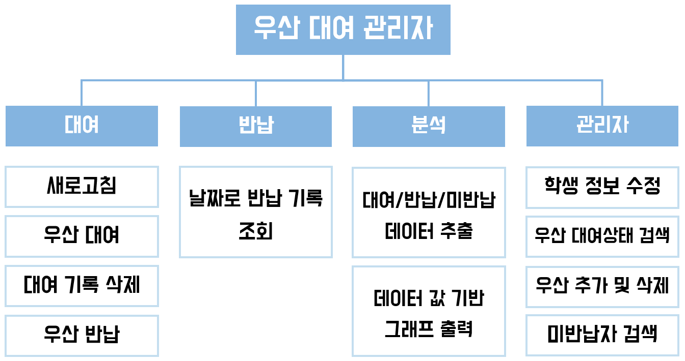
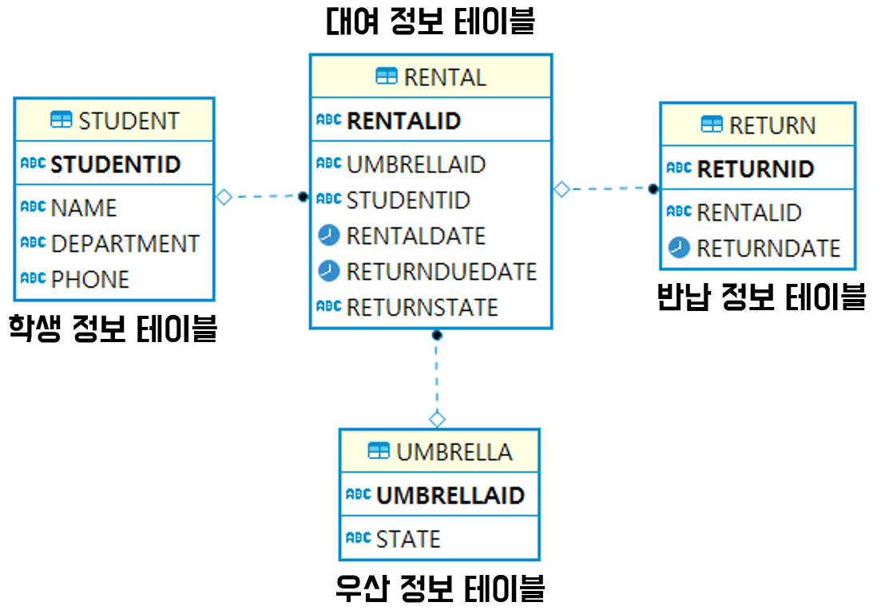
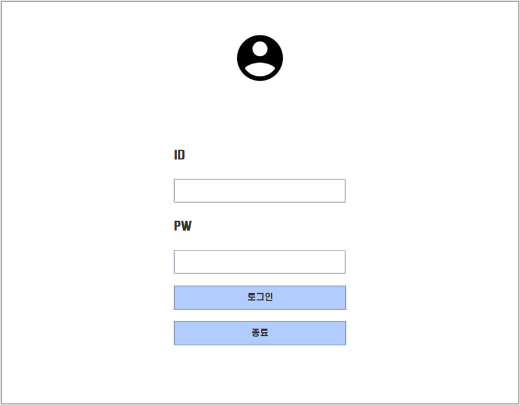
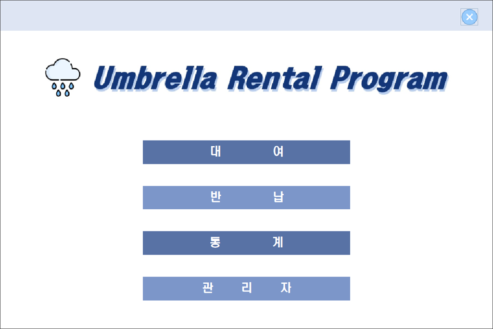
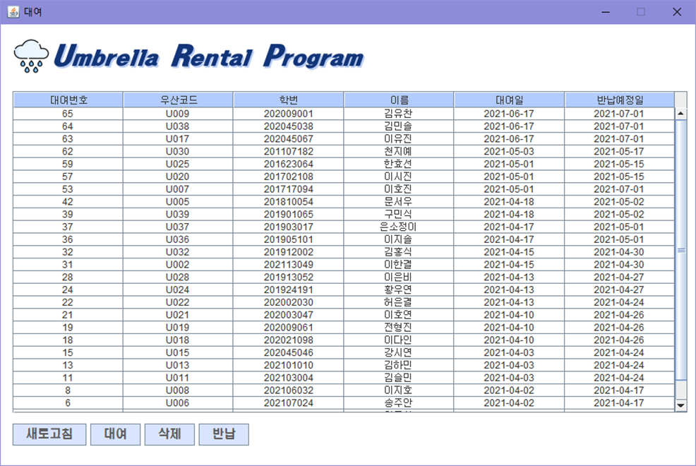
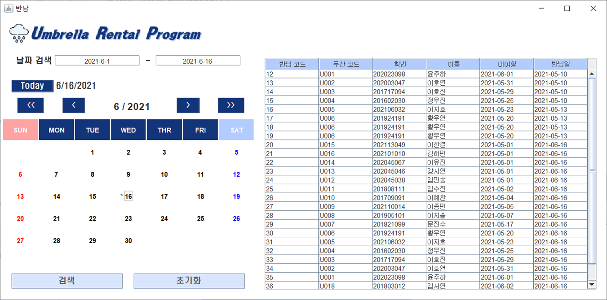
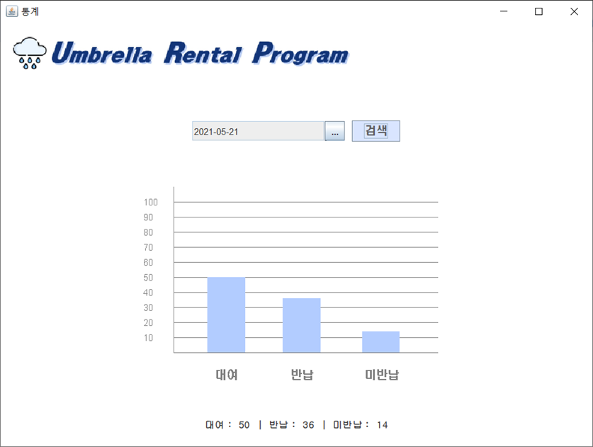
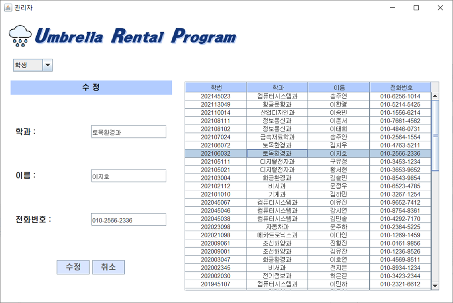
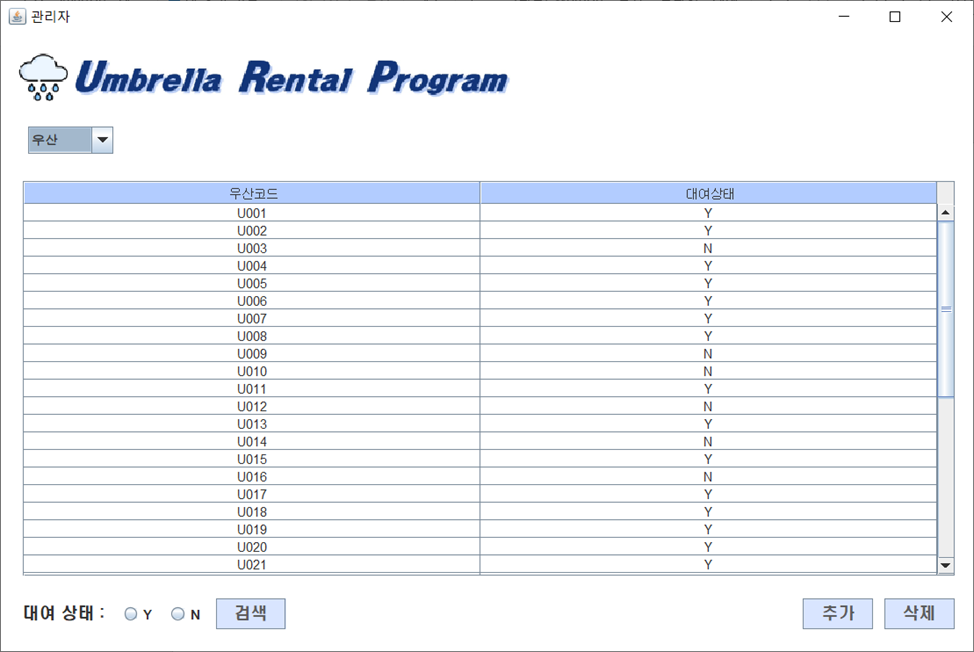
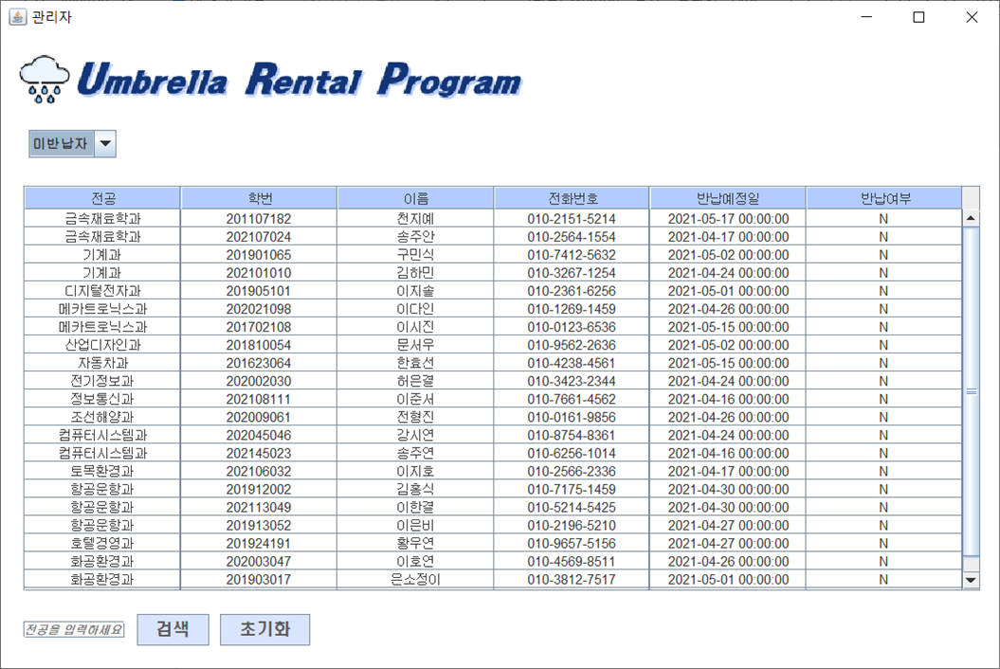

## 우산 대여 프로젝트_UmbrellaProject

 
 

## 📑 프로젝트 개요
교내에서 우산대여 서비스를 시행했다.  
아직 우산 대여를 관리할 프로그램이 구현되지 않아 대여 학생과 우산 명부를 학생들이 수기로 적고 있다.  
수기로 직접 작성하는 것은 명단이 누락 되거나 관리가 어렵다는 단점이 있어 이를 보완하고자 이번 프로젝트를 진행하게 되었다.
 

## 📋 시스템구성 및 기능

### [ 시스템 구조 ]  

### [ 데이터베이스 구조 ]  

 

## 💻 프로젝트 구현

### [ 로그인 ]

### [ 메인 ]

### [ 대여 ]

### [ 반납 ]

### [ 통계 ]

### [ 관리자 - 학생 ]

### [ 관리자 - 우산 ]

### [ 관리자 - 미반납자 ]

### [ 구현 영상 ]

